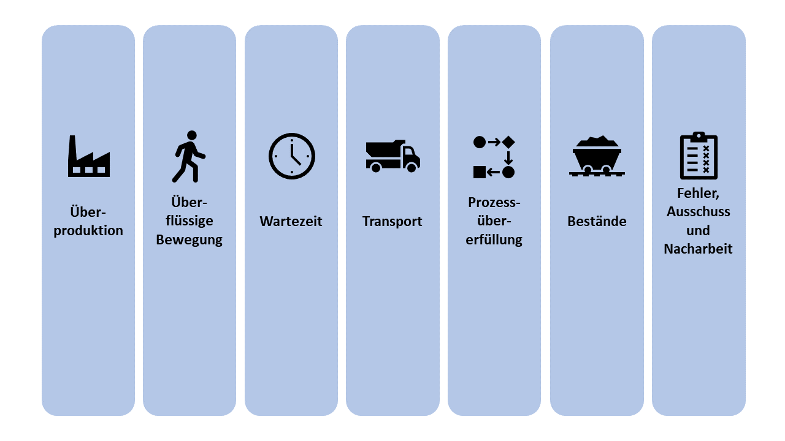
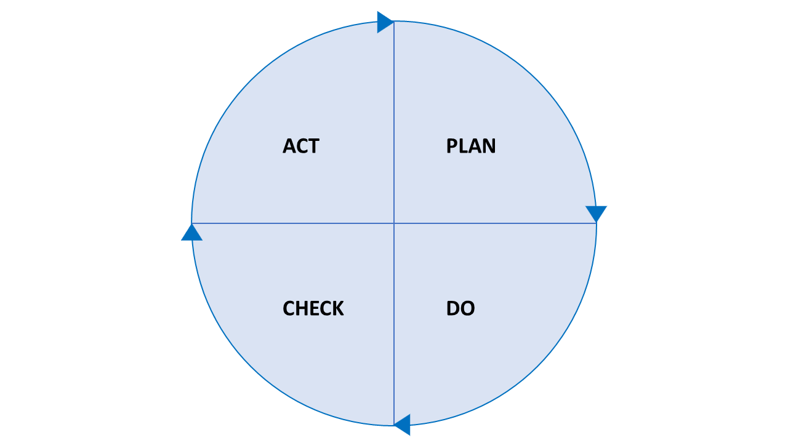

# Lean Management

---

## Agenda

1. Einleitung
2. Der Kunde
3. Verschwendung
4. Kontinuierliche Verbesserung
5. PDCA-Zyklus
6. Führung
7. Fehlerkultur

---

## Einleitung

- Unternehmensphilosophie mit Ursprung in der Produktion
- Verschwendungsfreie Prozesse in der Produktion
- Entwicklung zu "Lean" als Gedanke
- Verankerung von Lean in der Strategie & Kultur
- Starke Verpflechtung mit der japanischen Kultur
- Effizienz und Effektivität verbinden!

---

## Der Kunde im Mittelpunkt

- Wert des Produkts entsteht durch den Kunden
- Definition des Produktwertes aus Kundensicht
- Vorteile statt Produkte verkaufen
- Unternehmersicht vs. Lean Management
- Anforderungen des Kunden zeigen Anforderungen an das Unternehmen
- Ziel: Erreichen von 100% Kundenzufriedenheit bei möglichst geringen Kosten

> **Kundenorientierung**

---

## Verschwendung 無駄

## 

---

## Kontinuierliche Verbesserung 改善

- Kai (Veränderung) + Zen (zum Guten)
- permanente Verbesserung von Prozessen und Produkten
- DE: Kontinuierlicher Verbesserungsprozess (KVB)
- Keine Einführung von Vorschlagwesen--> Mitarbeitermotivation
- Verbesserungen entlasten Mitarbeier und minimieren Verschwendung

---

## PDCA-Zyklus

## 

---

## Von der Produktion zur Unternehmensphilosophie

- ganzheitlicher Ansatz
- Lean Thinking: Denkweisen statt Methoden
  z.B. Lean Administration, Lean Product Design, Lean Development etc.

---

## Führung

- Lean Leadership: Mensch und seine Kompetenzen im Mittelpunkt
- Verantwortungsübergabe an die Mitarbeiter
- Keine Vorgabe von Lösungen und Antworten --> Coaching
- Befähigung der Mitarbeiter für mehr Kreativität und Innovation
  --> **Mitarbeiterorientierung**

---

## Fehlerkultur

- Positive Fehlerkultur
- Suchen nach Lösungen, statt Schuldigen
- Schuld im Prozess oder bei den Standards
- Fehler als Möglichkeit zur Verbesserung
- Hansei: Reflexion

---

## Lean Administration
