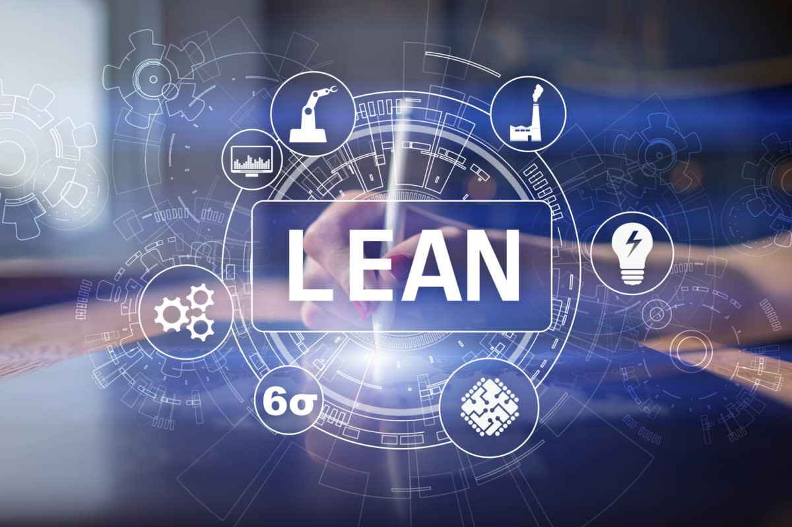

## 

---

## Agenda

1. Einleitung
2. Der Kunde
3. Verschwendung
4. Kontinuierliche Verbesserung
5. PDCA-Zyklus
6. Führung
7. Fehlerkultur
8. Lean Administration
9. Quellen

---

## Einleitung

- Unternehmensphilosophie mit Ursprung in der Produktion
- Verschwendungsfreie Prozesse und Ressourceneffizienz
- Entwicklung zu "Lean" als Denkweise
- Verankerung von Lean in der Strategie & Unternehmenskultur
- Starke Verpflechtung mit der japanischen Kultur
- Effizienz und Effektivität verbinden!

---

## Der Kunde im Mittelpunkt

- Wert des Produkts entsteht durch den Kunden
- Definition des Produktwertes aus Kundensicht
- Verkauf von Vorteilen statt Produkten
- Unternehmersicht vs. Lean Management
- Anforderungen des Kunden zeigen Anforderungen an das Unternehmen
- Ziel: Erreichen von 100% Kundenzufriedenheit bei möglichst geringen Kosten

> **Kundenorientierung**

---

## Verschwendung 無駄

## 

---

## Kontinuierliche Verbesserung 改善

- Kai (Veränderung) + Zen (zum Guten)
- Permanente Verbesserung von Prozessen und Produkten
- DE: Kontinuierlicher Verbesserungsprozess (KVB)
- Keine Einführung von Vorschlagwesen--> Mitarbeitermotivation
- Verbesserungen entlasten Mitarbeiter und minimieren Verschwendung

---

## PDCA-Zyklus

## 

---

## Von der Produktion zur Unternehmensphilosophie

- Ganzheitlicher Ansatz
- Lean Thinking: Denkweisen statt Methoden
  z.B. Lean Administration, Lean Product Design, Lean Development etc.

---

## Führung

- Lean Leadership: Mensch und seine Kompetenzen im Mittelpunkt
- Übergabe von Verantwortung an Mitarbeiter
- Keine Vorgabe von Lösungen und Antworten --> Coaching
- Befähigung der Mitarbeiter für mehr Kreativität und Innovation

> **Mitarbeiterorientierung**

---

## Fehlerkultur

- Positive Fehlerkultur
- Suche nach Lösungen, statt Schuldigen
- Schuld im Prozess oder bei den Standards
- Fehler als Möglichkeit zur Verbesserung
- Hansei: Reflexion

---

## Lean Administration

#### Verschwendungsarten im indirekten Bereich

1. Überinformation & Überproduktion
2. Wartezeit & Suchen
3. Fehler & Nacharbeit
4. Informationstransfer

---

## Quellen 1

### Bilder

[https://www.capterra.com.de/blog/531/lean-project-management-leitfaden]

---

## Quellen 2

### Inhalt

BERTAGNOLLI, Frank, 2020. Lean Management: Einführung und Vertiefung in die japanische Management-Philosophie [online]. 2nd ed. 2020. Wiesbaden: Springer Fachmedien Wiesbaden, Imprint: Springer Gabler.

HELMOLD, Marc, 2023. Lean Management und Kaizen: Grundlagen aus Fällen und Beispielen in Operations und Supply Chain Management [online]. 1st ed. 2023. Cham: Springer International Publishing
